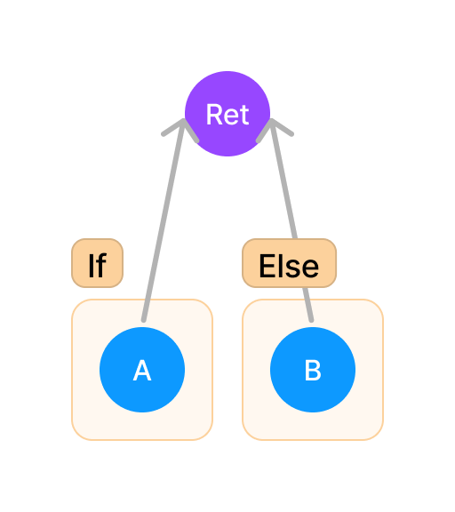
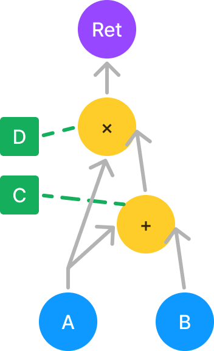

# ADG with Set Theory

## Goals

- Lazy

    can apply change all at once, it is for Optimizer.

- Set Theory

    Every node has parent set and find their sub set below O(n), it is equal to [scope in IR](../IR.md#scope)

- can remove a lot of node

## Theory

We use $\subset$ and $\supset$ to indicate proper subset and proper superset

Add Set Theory to ADG. For given any two set $A$ and $B$, their relationship is either $A\subset B$ or $A\cap B = \emptyset$. The function is $U$ set. BP only iterate $\set{x | x \in B \cup \set{\forall A \subset B}'}$ to reduce function top level variable & complex BP.

```rust

struct VariableMap {
    map: HashMap<VariableName, VariableStack>
}

struct VariableStack {
    stack: LinkList<NodeId>
}
```

`VariableMap` is a map mapping variable name to ADG node id, VariableStack is use to solve variable shadowing. When a variable assign with new value, node id will change to the node of new value.

## Test

### [test1](../EdgeCase.md#test1)

It cannot solve this test because proc-macro cannot know whether the call take the value or not.

### [test1](../EdgeCase.md#test2)

TODO

### [test3](../EdgeCase.md#test3)



### [test4](../EdgeCase.md#test4)

TODO

### [test5](../EdgeCase.md#test5)


